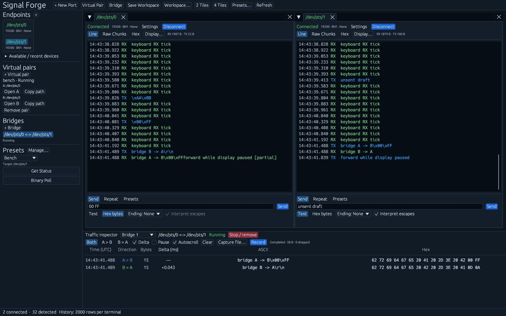
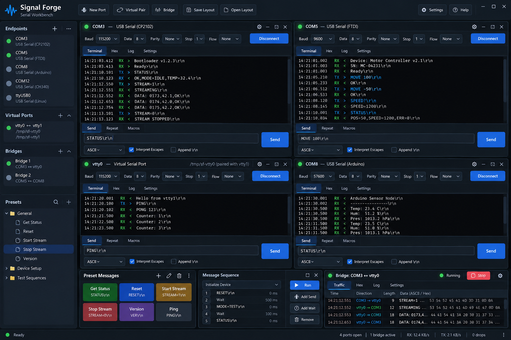

# Signal Forge

A Linux serial-port workbench implemented in Rust with egui/eframe. The app provides independently configured serial connections, dockable terminals, validated text/hex sending, independent repeated sends, saved preset profiles, owned virtual PTY pairs, full-duplex bridges, streaming captures, and saved workspaces.

## Current implementation



## Target UI



This concept image is the design reference for the finished application. The current implementation follows its dark blue desktop shell, endpoint navigation, green connection indicators, per-pane configuration controls, black terminal surfaces, blue send/disconnect buttons, and dockable port tiles. A compact toolbar opens setup dialogs, the left sidebar navigates endpoints and presets, and the lower traffic inspector keeps bridge controls above aligned rows. Receive traffic has priority; serial settings and advanced tools expand when needed.

## Build and run on Linux

Install a current stable Rust toolchain with Cargo. On Debian/Ubuntu:

```sh
sudo apt-get install build-essential pkg-config libudev-dev libxkbcommon-dev libxkbcommon-x11-dev libwayland-dev libx11-dev libxi-dev libgl1-mesa-dev
cargo run
```

Run from a graphical X11 or Wayland session. For diagnostic logging:

```sh
RUST_LOG=signal_forge=debug cargo run
cargo test --all-targets
cargo build --release
```

The executable is `target/release/signal-forge`. To explicitly open devices at launch, pass `--port /dev/ttyUSB0 --port /dev/ttyUSB1`. Your account needs read/write access to its serial devices; on many distributions this is provided by the `dialout` or `uucp` group. The application reports permission/open errors in its status bar.

## Using the workbench

1. Click **New Port** in the toolbar (or select an available/recent device in the sidebar), choose a device or type an existing `/dev/pts/N` path, and choose a standard baud rate from the dropdown (new connections default to **19200**), data bits, parity, stop bits, and flow control. **Custom…** allows other positive whole-number baud rates; saved baud settings remain unchanged.
2. Confirm **Open port** to create a terminal. Cancel leaves existing connections unchanged. Opening a second device initially splits the workspace side-by-side. Drag tabs to dock and rearrange them; closing a tab disconnects its device. The compact pane header shows connection state and framing. Expand **Settings**, disconnect to edit, then reconnect. **2 Tiles** and **4 Tiles** rearrange live terminals without reopening devices; tabs remain draggable.
3. Choose Text or Hex bytes in that terminal. Text optionally interprets `\r`, `\n`, `\t`, `\0`, `\xNN`, and `\\`. Hex accepts pairs of digits, optionally separated by whitespace, such as `00 FF 0D 0A`.
4. Choose an explicit line ending: None, CR, LF, or CRLF. Click Send or press Enter in the payload input. Enter keeps the field focused so you can send again immediately. Press **Up** in that field to cycle through previously accepted commands, newest first; **Down** moves towards newer commands and restores your unsent draft. Each terminal retains its own latest 100 entries for this session. Recall restores encoding, escape handling, and line ending; manual sends, presets, and repeat starts each add one entry, consecutive identical commands are deduplicated, and rejected sends are excluded. Recalled repeat commands send once when you press Enter; use **Start repeat** to repeat them again. Invalid input is rejected before any bytes are queued. TX rows report bytes accepted by the serial writer.
5. Select the **Repeat** tool beneath the receive canvas. Set **Repeat every** in milliseconds, choose a finite count or **Until stopped**, and click **Start repeat**. The count includes the initial send. Each terminal has one independent repeat job; its progress counts fully written payloads. The job takes a snapshot of the encoded payload, so editing the send box does not alter an active repeat. **Stop repeat**, disconnecting, closing the tab, or a device fault stops further repeated writes. Bytes already accepted by the serial driver cannot be recalled. Intervals are best-effort and begin after each full write, without catch-up bursts.
6. Choose **Line**, **Raw Chunks**, or **Hex** independently in each terminal. Line mode assembles RX across serial reads; **Auto** accepts CRLF, LF, and CR (including CRLF split between events). The delimiter selector can also require LF, CRLF, or CR exactly; other control bytes remain escaped. Completed lines omit their terminator, empty lines get their own row, and unterminated data stays visible as **[partial]**. Valid UTF-8 is readable even when split across reads; invalid bytes are escaped. Line timestamps refer to the first byte. TX keeps its own event row and never flushes pending RX. Raw Chunks and Hex show the original event boundaries, sequence numbers, and exact escaped/hex bytes. Switching modes keeps both raw history and pending RX. Mode and delimiter are saved per terminal; older workspace Hex preferences remain supported.
7. Open **Display…** for delimiter, timestamps (UTC), auto-scroll, pause, and clear controls. Clear resets both display histories and pending RX. Pause display discards new rows while serial I/O continues; an RX gap resets pending assembly so bytes across a pause are not joined. Changing the delimiter rebuilds Line view from retained raw history.
8. **Workspace…** provides explicit Save to file and Load workspace actions. Loading validates the file before replacing the layout, disconnects current resources, and restores terminals disconnected. Cancel changes nothing. Save the default workspace with **Save Workspace** or **Ctrl+S**, or quit normally to save it automatically to `$XDG_CONFIG_HOME/signal-forge/workspace.json` (or `~/.config/signal-forge/workspace.json`). Restart restores split ratios, stacked/active tabs, floating window positions/sizes, terminal display and send options, per-device serial settings, recent devices, and the selected preset profile. Every restored terminal is disconnected: reconnect explicitly. Payload drafts, traffic history, repeats, bridges, captures, and owned PTYs are session-only and never restart automatically. Corrupt/unsupported configuration is reported and preserved; saving stays disabled until repair or **Back up original and reset workspace**. That recovery action keeps an exact numbered `.json.recovery-N` backup for manual recovery of settings. Version 1 port settings migrate to version 2 when next saved.

Each terminal retains up to 2,000 raw events and 2,000 completed Line/TX rows, plus a pending RX line. Line payloads are capped at 64 KiB with an explicit display truncation marker; raw bytes, statistics, bridges, and captures remain unchanged. RX and TX have distinct labels and colors. Binary bytes are rendered with escapes in text mode. A bounded monitoring queue reports dropped events in the status bar. Monitoring is best-effort, not a lossless capture mechanism.

## Preset profiles

The left sidebar contains the active profile and quick command buttons. Click an endpoint card or terminal pane to select its target, then click a preset name to send. A terminal’s **Presets** tool offers the same commands for that pane. **Manage…** or the toolbar’s **Presets…** opens the library editor. **New preset** opens an editor for name, payload, encoding, escapes, line ending, selected/fixed endpoint target, description, shortcut, and optional repeat settings. **Edit**, **Delete**, **Up**, and **Down** update the profile immediately. A repeating preset refuses to replace a running repeat; stop that job first.

Create named device/project profiles with **Create profile**. Changes are validated and saved separately from workspace settings in `signal-forge/presets.json` under the configuration directory. Presets never send merely because a profile is loaded or imported. Invalid or unsupported files are preserved and reported rather than silently replaced.

Use **Export profile** and **Import profile** with a JSON file path. The human-readable format is `{ "version": 1, "profile": { "name": "Bench", "presets": [...] } }`; it preserves all send and repeat settings. Import replaces a profile with the same name and rejects invalid payloads, schedules, or conflicting shortcuts before modifying the library. Shortcuts are **Ctrl+1** through **Ctrl+9**, scoped to the active profile and suppressed while editing text or a preset.

## Virtual pairs and bridges

Click **Virtual Pair** in the toolbar/sidebar (or **Ctrl+Shift+N**) to open setup, enter a pair name, and confirm **Create pair**. Cancel creates no resources. The two raw Linux PTY paths are displayed with **Copy path** and **Open A/B** actions. External programs can open either end; bytes written to A arrive at B and vice versa. Multiple pairs are independent. Optionally enter a writable **Link directory** to create `<name>-a` and `<name>-b` symlinks. Existing paths are never overwritten, and failed creation rolls back any link already created.

**Remove pair** disconnects its app terminals and releases its relay and owned links. Closing the application does the same; **Ctrl+Q** closes the application normally. PTY paths last only for the lifetime of the pair. The internal relay uses bounded buffers and retains partial writes under backpressure; it does not require `socat`.

Open two terminals, click **Bridge** (or **Ctrl+Shift+B**), choose connected endpoints **A** and **B** in setup, then confirm **Start bridge**. Cancel leaves forwarding unchanged. Bridges support serial devices and PTY paths using the same endpoint interface. Each endpoint can belong to one running bridge. RX from A is sent to B and RX from B is sent to A; manual and repeated sends remain available and serialize with bridge writes.

The lower bridge monitor labels each direction **A → B** or **B → A**. **Pause display** (or **Ctrl+Shift+M** for all bridge monitors) discards new display rows while forwarding continues. **Stop / remove** leaves both endpoints open. Disconnecting either endpoint faults the bridge; restoring a connection requires starting a new bridge explicitly. Bounded monitor queues can drop display events without affecting forwarded bytes. Transport write failures fault the bridge; already accepted bytes cannot be recalled.

## Bridge traffic inspector and captures

Select a bridge in the lower **Traffic inspector**. Its identity, state, filters, and capture controls remain above the scrolling rows. Each row aligns UTC time, direction, byte count, ASCII escapes, and raw hex; hover for full timestamp/sequence metadata or truncated payloads. **Delta** adds the time since the previous observed chunk; it uses the complete chronological stream even when direction filters hide rows. Choose **Both directions**, **A → B**, or **B → A** without discarding the other direction's retained history. Sequence gaps are marked explicitly. The inspector retains at most 1,000 chunks per bridge and renders only visible rows; **Auto-scroll**, **Clear display**, and **Pause display** control presentation.

Open **Capture file…**, enter a writable path, and click **Record**. **Ctrl+Shift+R** starts/stops recording on the first bridge. Recording always includes both directions, independently of display filters, clear, and pause. A dedicated worker streams raw bytes and metadata directly to disk through its own bounded queue. Existing files are never overwritten; choose a new filename to start another capture. **Stop capture** changes the state to **Finishing**, then **Completed** after queued events and the end summary are saved. Endpoint faults, removing a bridge, and normal shutdown also finish recording.

Captures use [versioned JSON Lines](./docs/capture-format.md), with raw byte arrays, exact Unix nanosecond timestamps, signed deltas, source IDs, and direction. The footer records the capture's own dropped-event count; overloaded captures report incomplete data while forwarding continues. UI history limits do not limit file length. Files without a footer were interrupted or encountered a write failure.

## Architecture

- `endpoint`: stable IDs, connection states, errors, transport-independent asynchronous TX interface.
- `traffic`: timestamped raw-byte RX/TX events, shared payloads, ordered nonblocking fan-out.
- `serial`: device discovery and a worker per open port; all physical I/O is outside widgets.
- `send`: pure, all-or-nothing escape/hex encoding and explicit line endings.
- `presets`: validated command/profile models, atomic persistence, and versioned JSON import/export.
- `repeat`: transport-independent scheduling, finite counts, progress, and cancellation tokens; serial workers drive timers independently of GUI repainting.
- `virtual_pair`: owned raw Linux PTYs, optional named links, and a bounded full-duplex relay.
- `bridge`: transport-neutral RX routes, serialized destination writes, lifecycle control, and independent directional monitoring.
- `inspector`: bounded display history, UTC timestamp formatting, chronological deltas, and direction filters.
- `capture`: streaming JSON Lines writer, independent bounded subscriptions, integrity summaries, and controlled shutdown.
- `config` / `workspace`: validated versioned workspace persistence, v1 migration, disconnected restoration, backup recovery, and durable atomic replacement.
- `app`: device controls and dock layout. `app/terminal_ui` composes separate serial-settings, display-controls, connection-status, virtualized traffic, send, repeat, and footer sections. `app/workbench_ui` owns toolbar/sidebar navigation, setup drafts, preset-library access, and live tiling. `app/theme` owns the shared navy/canvas palette, RX/TX and status colors, typography, compact spacing, and primary/danger buttons for all UI surfaces.

A slow subscriber loses monitoring events instead of blocking a serial worker. Sequence numbers expose gaps. Bridges forward through a dedicated transport RX route into the destination writer, independently of the lossy monitor bus. Independent read handles keep both RX directions active while writes are serialized. Closing a terminal stops its worker and drops its device handle; closing the application drops all terminals.

## Keyboard shortcuts

| Shortcut | Action |
| --- | --- |
| Enter / Up / Down in payload | Send / recall older / return toward draft |
| Ctrl+L | Focus the selected terminal payload (outside text editing) |
| Ctrl+O | Open new-port setup (outside text editing) |
| Ctrl+Alt+2 / 4 | Arrange live terminals into two/four tiles (outside text editing) |
| Ctrl+Shift+S | Open workspace save/load setup (outside text editing) |
| Ctrl+Shift+O | Reconnect selected disconnected terminal |
| Ctrl+Shift+D | Disconnect selected terminal and stop its repeat/bridge |
| Ctrl+W | Close selected terminal and disconnect it |
| Ctrl+S | Save workspace |
| Ctrl+1 … Ctrl+9 | Active profile presets (outside text editing) |
| Ctrl+Shift+N / B | Open virtual-pair / bridge setup (outside text editing) |
| Ctrl+Enter / Escape in setup | Confirm port/pair/bridge setup / cancel |
| Ctrl+Shift+M / R | Pause bridge displays / toggle first bridge capture |
| Ctrl+Q | Quit, save workspace, and finish capture/cleanup |

## Linux package

Each passing CI run builds and uploads **signal-forge-linux-x86_64** with a release
binary, desktop launcher, installer, documentation, linked-library list, and SHA-256
checksum. Download it from the repository's **Actions** run, unzip the artifact,
verify `sha256sum -c *.sha256`, unpack the tarball, and run `bash install.sh` (requires Python 3).
The default installation is `~/.local`; an optional path argument changes it.
You can also run the included `bin/signal-forge` directly. The package targets
Ubuntu 24.04 x86_64 or compatible newer glibc Linux with X11/Wayland and OpenGL.

Build the same package locally with `bash scripts/package-linux.sh`. Configuration
and captures are excluded from the archive. Merges to `main` automatically run the
full build/test/package pipeline and publish a GitHub Release with the archive and
checksum. Each merge increments the patch version: the first release with the new
automation is **0.1.1**, followed by **0.1.2**, **0.1.3**, and so on. Tags use
`v0.1.1`; the release title, archive name, and executable's `--version` agree.
Releases are published only after all checks pass. Rerunning a commit keeps its
version and updates the same release. Direct pushes to `main` also increment the
patch. A merge counts once regardless of the number of commits on its PR branch.

`Cargo.toml` stores the base version. CI adds the number of first-parent commits
since that base version was introduced and updates the root package in both Cargo
files for the build, without committing back to `main` or triggering another release.
Dependency edits do not reset the count. To start a new minor or major series,
explicitly update the base version in both Cargo files to a version higher than
the latest release. A full Git checkout is required for automatic versioning.
For the same version locally, run `python3 scripts/release-version.py --apply`
before packaging. PR artifacts remain available before merge for review.

## Verification

See the [manual Linux smoke checklist](docs/manual-smoke-test.md) for release and
physical-device checks. CI runs pure encoding/scheduling/history tests and real
Linux PTY flows for text/CRLF, arbitrary binary, independent endpoints, finite
repeats/cancellation, concurrent duplex bridges/backpressure, disconnect/reopen,
traffic filtering, capture integrity, and shutdown. Workspace tests cover migration,
layout/options round trips, invalid/corrupt config preservation, and atomic saves.
Xvfb GUI tests exercise presets, Enter/Up/Down, real forwarding/capture, restart
without opening or transmitting, recovery, and graceful cleanup. UI checks exercise four live panes at 1920×1080, 2560×1440, and the 900×600 minimum, narrow-pane transmission, two/four-tile rearrangement without reopening, and setup cancellation. The release archive
is extracted, checksum-verified, installed into a temporary prefix, and launched
with `--help` in CI. Physical adapters and electrical flow/parity behavior require
a local bench and are not claimed as PTY test coverage.
