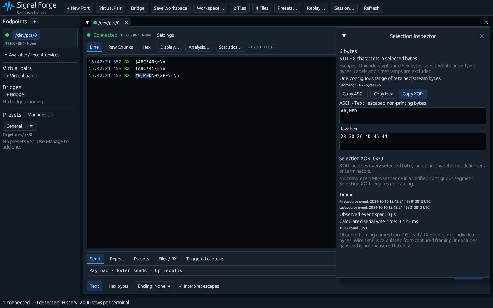

# Selection Inspector

Highlight terminal traffic to open the Selection Inspector. It follows the selected terminal, updates as the highlighted range changes, and can be moved, resized, collapsed or closed. While dragging a terminal selection, the inspector does not take mouse input. A new selection reopens a closed inspector. Existing terminal Ctrl+C behavior remains unchanged; inspector copy buttons provide payload-only representations.

The inspector shows exact byte count, UTF-8 character count when the selected bytes form valid UTF-8, escaped ASCII/text, raw hex, Selection XOR, event timing and calculated serial wire time. Copy ASCII, Copy Hex and Copy XOR include the complete selection. Long previews show only the first 4096 bytes.

## What is selected

Selection maps visible glyphs back to their underlying bytes in Line, Raw Chunk and Hex views. Selecting any part of an escape such as `\xFF`, a hex byte, or a Unicode glyph selects that whole underlying byte or Unicode byte sequence. Hex spacing, timestamps, RX/TX labels, chunk numbers, timing annotations and display-status labels have no payload bytes.

Literal text that happens to look like an escape still selects its literal bytes. For example, highlighting the `x` in a device's literal `\xFF` text selects byte `78`, not byte `FF`.

Line endings are selected when visible with **Display → Show Control Characters**. Hidden line endings and UI-inserted newlines between displayed rows are not added to the selected payload. With visible line endings, selecting the same complete traffic in each view yields the same bytes and checksums.

RX/TX changes, omitted source bytes (including hidden line endings or filtered rows), pauses and display truncation create separate segments. The inspector lists their directions and byte ranges. Previews and Selection XOR concatenate only the bytes actually selected; they do not fill gaps. A contiguous retained stream range is not a claim that it is one protocol packet, or that traffic outside the monitoring history was captured.

## Checksums

**Selection XOR** XORs every selected byte exactly as selected, with no special treatment for delimiters or line endings. Selecting `#0,MED` includes the `#` and yields `0x73`. Selecting its CR/LF terminator too yields `0x74`.

**NMEA sentence validation** is an additional result. The inspector recognizes `$...*XX` and `!...*XX` sentences within each verified contiguous segment. It XORs only the payload between the start delimiter and `*`, compares the calculated and received hexadecimal checksum, and shows VALID or INVALID. CR/LF and the framing delimiters are excluded from this standard calculation. Multiple complete sentences can be inspected independently. Incomplete or malformed sentences still have Selection XOR; they are not marked valid NMEA sentences. Validation never joins separate segments into a sentence.

## Timing and retained metadata

First and last timestamps refer to contributing source events. A selected portion entirely within one OS read has an observed span of zero; exact per-byte arrival times are unavailable. Event order follows source sequence numbers, even when pending RX lines and TX rows are displayed in a different order. A backwards clock makes the observed span unavailable.

Calculated serial wire time uses only selected bytes and the baud/framing captured when their events were received. Mixed framing is listed separately and its calculated times are summed. For an emulated virtual pair, the captured framing is the shared link model. Calculated wire time excludes stream gaps and is not measured elapsed time, latency or a hardware timestamp.

Line assembly retains bounded event runs alongside the stored bytes, so metadata remains available even when an older contributing event leaves raw history. There are at most 1024 source runs per line; beyond that, bytes remain selectable but their source timing/continuity may be unavailable. The inspector reports missing metadata instead of inventing timestamps, wire times or packet continuity. NMEA validation requires retained continuity metadata; Selection XOR remains available for every byte range.
