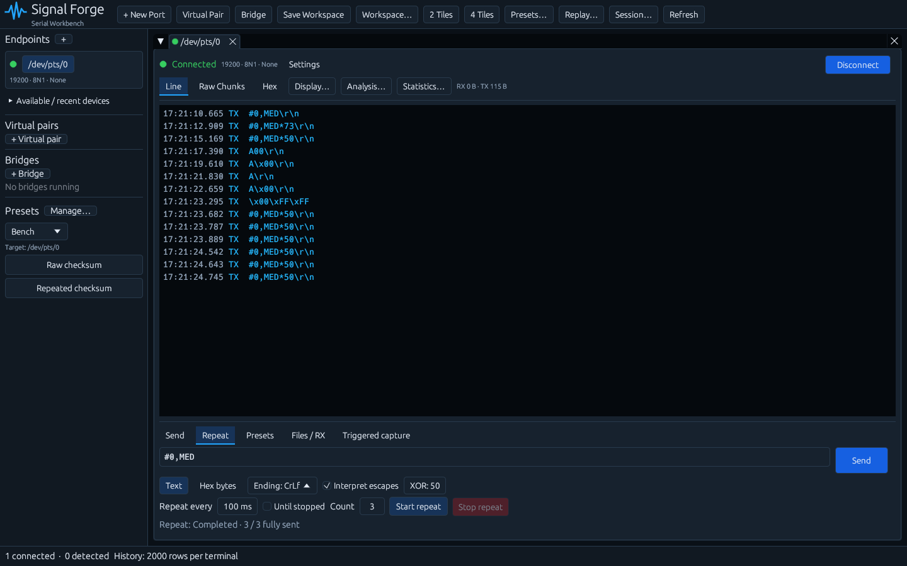

# Automatic TX checksum

Open **Checksum: Off** next to the terminal's encoding/line-ending controls and select **XOR**. Choose **Hex** (two uppercase ASCII hex digits), **\*Hex** (a `*` followed by those digits), or **Raw** (one binary checksum byte). The send controls display the calculated value before transmission; the menu shows it alongside the settings. Select **Off** to disable injection.

**Skip first byte** excludes exactly one parsed payload byte from the calculation, while still transmitting it. It does not inspect or assume any framing character. With UTF-8 input, it skips one byte, rather than one Unicode character.

Transmission order is:

1. Parse text, escapes or hex into payload bytes; invalid input is rejected entirely.
2. XOR the parsed bytes, optionally excluding the first byte.
3. Append the checksum in the selected output format.
4. Append the configured None/CR/LF/CRLF line ending.

For `#0,MED`, XOR including `#` is `0x73`; skipping it gives `0x50`. With \*Hex output and a CRLF ending, the resulting wire bytes are `#0,MED*73\r\n` or `#0,MED*50\r\n`. For `$ABC` with Skip first byte enabled, the result is `$ABC*40\r\n`.

Explicit control bytes inside the payload participate in XOR, including `\r`, `\n`, `\0` and `\xNN` when escapes are enabled. Only the separately configured line ending is excluded. Existing embedded checksum text is ordinary payload: no delimiters or prior checksum are removed. This version appends checksums; it does not replace tokens.

An empty checksum range yields zero. Empty payloads can therefore send `00`, `*00` or a raw zero byte plus the configured ending. Skipping the sole byte of a one-byte payload also produces zero, without dropping that byte from TX. ASCII output always has two digits, including leading zero.

Normal Send, Enter sends, repeats and saved presets use the same transform. Presets have independent checksum settings in their editor. A repeat captures the fully encoded message at Start; each iteration sends those identical bytes. Editing controls while it runs affects the next explicit Send or newly started repeat, not the active repeat.

Checksum settings survive workspace/session saves and command recall. Older workspaces and presets default to Off. Restoring settings never transmits automatically. File transfers currently retain their existing byte-preserving behavior; the reusable parsed-payload transform supports future sequence/file integration.
